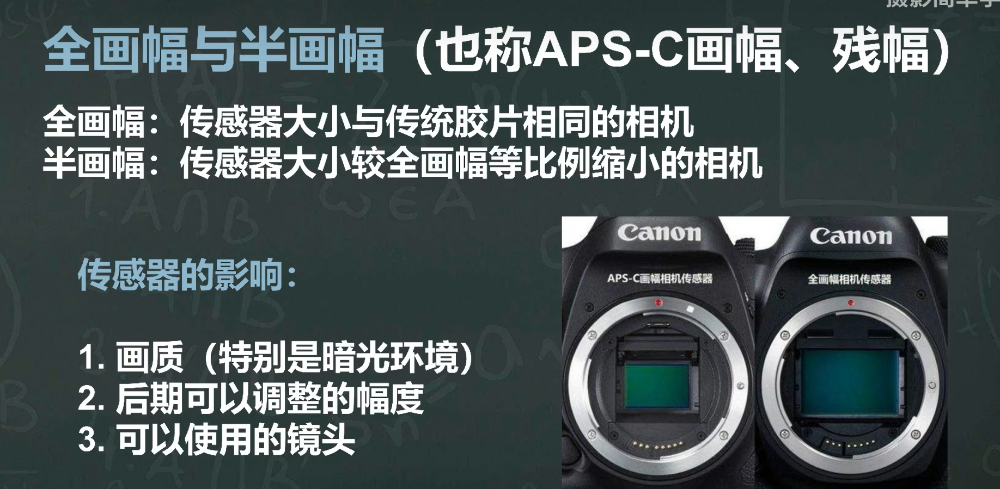

# 摄影学习

> Author: Sylvie233
>
> Date: 23/5/9
>
> Point: 

[TOC]

## 基础介绍

### 相机

#### 便携式相机（卡片相机）

#### 旁轴相机

#### **单反相机**

#### **无反相机**

画幅、光线传感器

#### 内存卡

U1

U3

USB3.0或以上

### 曝光

光圈、快门、ISO

曝光不足、曝光过度

### 光圈

f

光圈拍摄景深浅，主体清晰背景模糊（虚化）

### 快门

快门越慢，时间越长，**进光**越多

高快门凝固瞬间，慢快门记录轨迹

### ISO

感光度越高，感光能力越强，画质越粗糙，噪点多；感光度越低，感光能力弱，画质越细腻

### 拍摄模式

定义：底片在曝光过程中，采用哪种模式来让底片曝光的

#### M档

手动曝光

#### A档

光圈优先

#### S档

快门优先

#### P档

程序自动

### 相机镜头

按成像质量和方便性分：

- 定焦镜头
- 变焦镜头

焦距：代表镜头能看到的范围的多少

镜头越短，拍摄的范围越广，视长角越大；镜头越长，拍摄的范围越小，拍的距离越远

按焦距分：

- 广角：小于24mm
- 标准：50mm左右
- 中长焦：70~135mm（适合拍人像）
- 长焦：大于135mm（取景范围小，适合拍摄动物、体育）

焦距越长，景深越浅（背景越虚化）；焦距越短，景深越深

### 对焦模式

#### MF

手动对焦，通过手动调节镜头的对焦环来实现对焦，调到最清晰时按下快门

#### AF

##### AF-S

ONE SHOT，单次对焦模式

半按快门释放键完成对焦后，若重新构图，对焦主体改变，将进行重新对焦

##### AF-C

AI SERVO，连续对焦模式

##### AF-A

AI FOCUS，自动对焦模式，自动选择以上两种对焦模式中的一种

自动对焦

对焦点

### 白平衡

对光线颜色的影响进行补偿

#### AWB

自动白平衡，可对光源的特有颜色进行自动补偿：对多种混合光源也有补偿光源

#### 预设

##### 白炽灯

3200K

##### 白色荧光灯

4000K

##### 日光

5200K

##### 闪光

5900K

##### 多云

6000K

阴影

7000K

#### 自定义

### 闪光灯

内置闪光灯、外置闪光灯

### 滤镜

#### 保护镜

#### UV镜

#### 偏振镜/PL镜

#### ND中灰密度镜

#### 硬边GND中灰渐变镜

#### 软边GND中灰渐变镜

#### RGND反向中灰渐变镜

#### 彩色滤镜

#### 冷调、暖调滤镜

#### 近摄镜

#### 黑白滤镜

### 光

#### 光质

直射光（硬光），光方向性强，明暗反差大

散射光（柔光）

#### 光位

光源相对于相机与被摄体的位置，即光线的方向与角度。同一被摄体在不同的光位下就会产生不同的光位的明暗效果。

- 顺光：平顺光、高位顺光、正面平顺光
- 测光
- 逆光：突出被摄体的轮廓
- 顶光
- 底光

#### 光比

### 景别

- 远景
- 全景
- 中景
- 近景
- 特写

### 视角

- 高视角：适合宏大的场面
- 低视角：突出主体的高大
- 平视角

### 透视

- 单点透视：线性透视
- 空气透视：

#### 前景

增加画面空间的层次感

#### 背景

突出主题

#### 平面构图

点、线、面

#### 影调

**高调**

**低调**

**中间调**

### 摄影题材

#### 日出、日落

- 拍摄地点
- 拍摄时间
- 测光
- 构图

#### 瀑布

- 合适天气
- 滤镜

- 构图：动静结合

#### 烟花

- 小光圈
- 手动对焦
- 快门时机
- 三脚架
- 拍摄位置

#### 夜景人像

#### 夜景风光

- 时间
- 三脚架、快门线、手电筒、遮光板

## 核心内容

### 基础操作

- 拨盘档位（拍摄模式）
  - AV档：光圈优先
  - TV档：快门优先
  - P档：半自动档
  - A+档：全自动档
  - M档：全手动档
  - B档：长时间曝光档
- 屈光度

- 相机设置

  - 图像画质
    - RAW
    - JPEG
  - 色彩空间
    - sRGB
    - Adobe RGB
  - 长宽比：
    - 16:9

  - 测光模式

- 快门速度
- 光圈
- 感光度(ISO)
- 对焦
  - AF：自动对焦
  - MF：手动对焦（对焦环、变焦环）
- 热靴（闪光灯）

- 底部螺纹（三脚架）
- 储存卡槽、电池槽
- 开机、视频录制
- 接目环、接目镜
- 曝光锁定、放大按键
- 菜单按键、INFO按键
- 实时取景按键
- AV按键
- Q按键

### 影闪灯

瞬间光

### 常亮灯

持续光

### 影视灯

### LED灯

#### LED平板灯

#### LED聚光灯

#### LED补光灯棒

冰灯

### 红头钨丝灯

### 柔光箱

#### 四角柔光箱

#### 八角柔光箱

#### 长条柔光箱

#### 抛物线柔光箱

#### 灯笼罩

#### 柔光布

#### 格栅

### 配件

#### 标准罩

#### 反光伞

#### 柔光伞

#### 雷达罩

#### 束光筒

#### 四叶打光板

#### 反光板

#### 黑棋、白棋

#### 米菠萝

#### 三角架

##### 球形云台

##### 三维云台

快装板

平移轴、俯仰轴、中轴

##### 液压云台

### 相机镜头

焦距

定焦镜头、变焦镜头

光圈

恒定光圈、浮动光圈

### 索尼α 6300

### 索尼α 6400

### 佳能EOS 6D

**菜单**

**INFO**

放大键

播放键

录像

**屈光度**

**删除键**

**快捷菜单键**

**快门键**

半按快门对焦

**自动对焦点**

Lock键

### 佳能EOS 700D

**菜单键**

**INFO键**

**模式转盘**

**快捷菜单键**

自动对焦方式

驱动模式

- 单拍
- 连拍
- 定时拍

测光模式

图像画质

白平衡

照片风格

亮度优化

### 佳能EOS R6Ⅱ

### 佳能EOS R10

### 尼康D80

### 尼康ZFC

### 富士X-S10

### 松下S5Ⅱ

### 大疆Action 3

