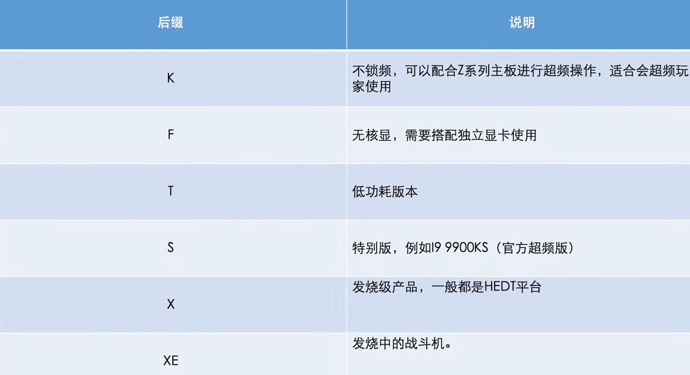

# 电脑维修学习

> Point

[TOC]

## 基础介绍

intel-CPU后缀字母

CPU推荐

主板产商

- 华擎
- 华硕
- 技嘉
- 微星

主板类型

内存条推荐

- 海盗船
- 金士顿
- 芝奇
- 威刚
- 光威

固态硬盘类型

机械硬盘类型

## 核心内容

### CPU

#### i3

##### 9100

##### 10100

#### i5

##### 9400

##### 10400

##### 10600K

#### i7

##### 8750H

##### 10700K

##### 10700KF

#### i9

##### 9900K

##### 10900K

------

#### R3

##### 3100

##### 3200G

##### 3300X

##### 3400G

#### R5

##### 3600

#### R7

##### 3700x

#### R9

##### 3900X

##### 3950X

### 主板

#### A

##### 320

#### B

##### 460

##### 550

#### H

##### 410

#### X

##### 570

#### Z

##### 490

### 散热

### 内存

### 显卡

#### GTX

##### 1650 D6

##### 1650S

##### 1660

##### 1660Super

##### 1660TI

#### RTX

##### 2060

##### 2060Super

##### 2070Super

##### 2080Super

##### 2080TI

##### 3080

#### RX

##### 5500XT

##### 5600XT

##### 5700

##### 5700XT

##### 580 2048sp

##### 590

### 硬盘

#### 西数

##### SN550

##### SN750

#### 铠侠(东芝)

##### RC10

##### RD10

#### 三星

##### PM981

##### PM981A

##### PRO970

### 电源

### 机箱