# 	调酒师

> Author: Sylvie233
>
> Date: 23/8/4

[TOC]

## 基础介绍

### 利口酒

### 金酒

### 威士忌

SCOTCH苏格兰威士忌

波本威士忌

#### 芝华士

#### 尊尼获加

#### 白占边Jim Beam

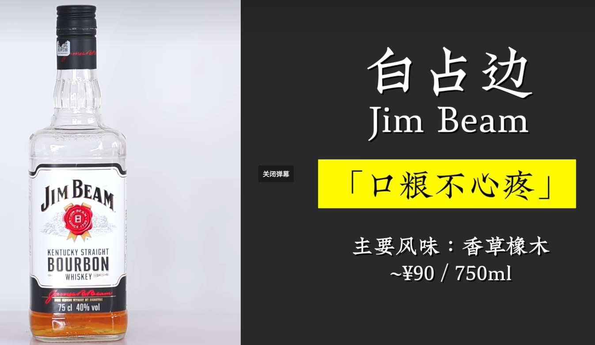

#### 麦卡伦

#### 水牛足迹Buffalo Trace

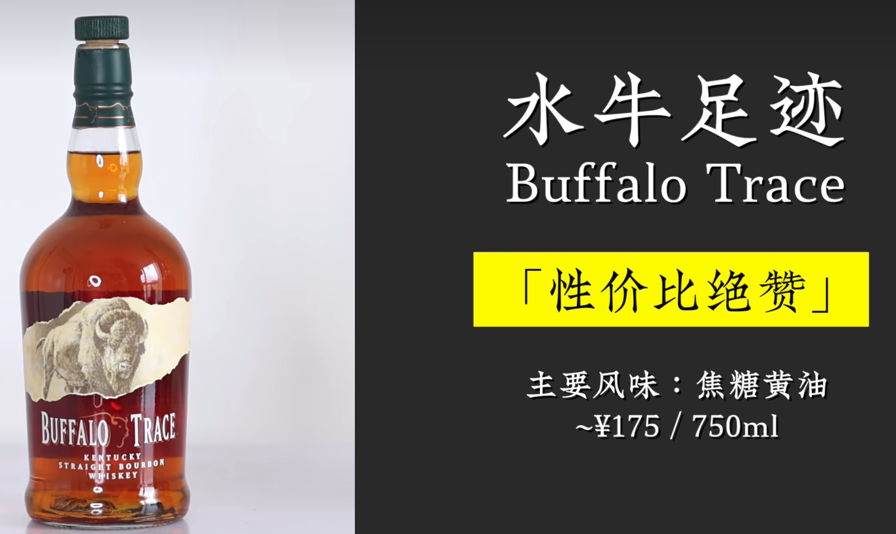

#### 威凤凰Wild Turkey

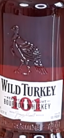

#### 美格46Maker's Mark46

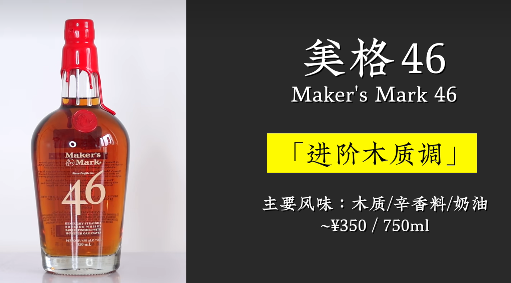

#### 巴兹海顿Basil Hayden

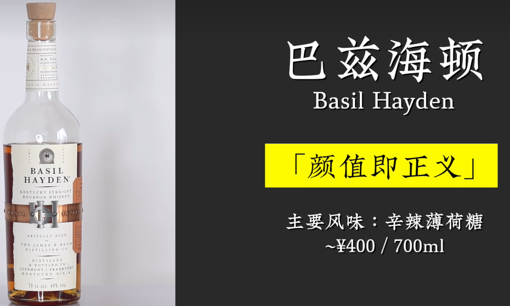

#### 酩帝诗Michter's

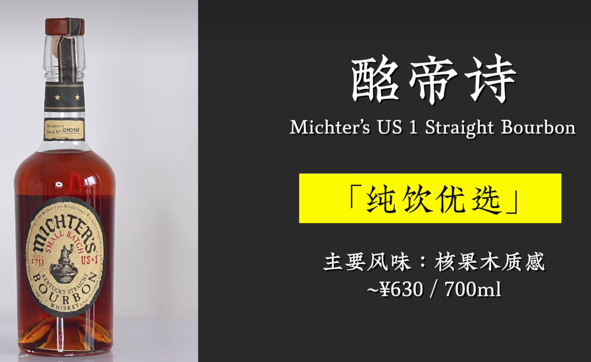

#### 欧肯特轩AUCHENTOSHAN

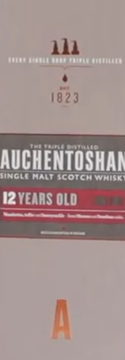

#### 格兰威特GLENLIVET

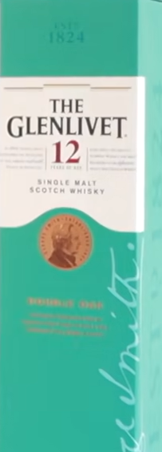

#### 格兰杰GLENMORANGIE

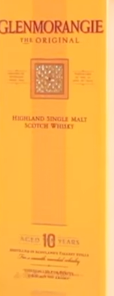

#### 阿贝ARDBEG

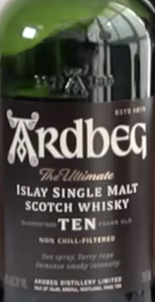

#### 欧磨Aultmore

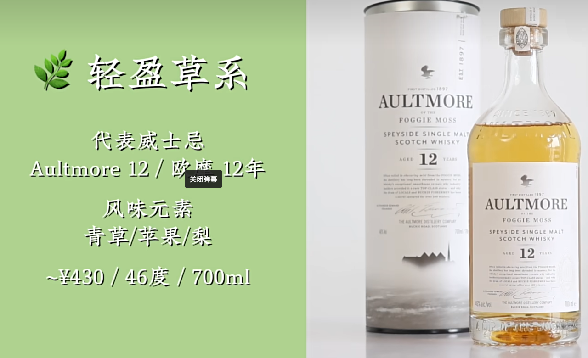

#### 艾伦Arran

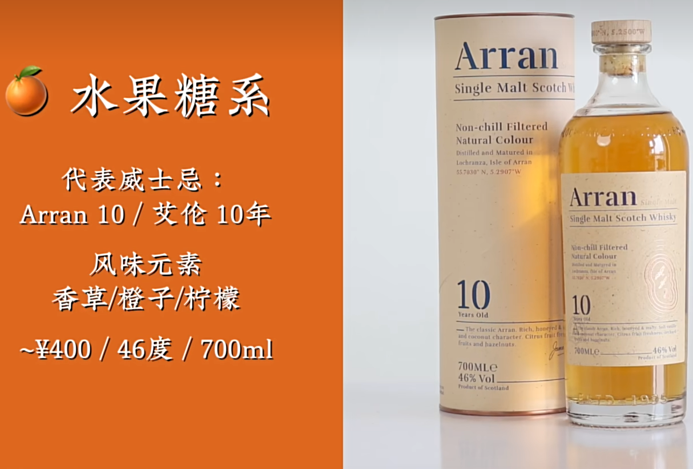

#### 亚伯乐阿布纳

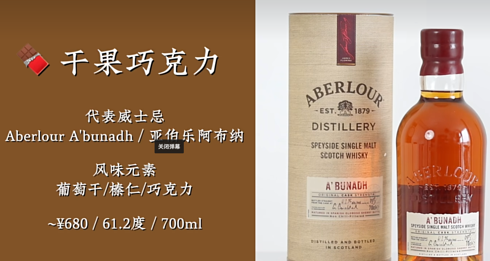

#### 高原骑士Highland Park

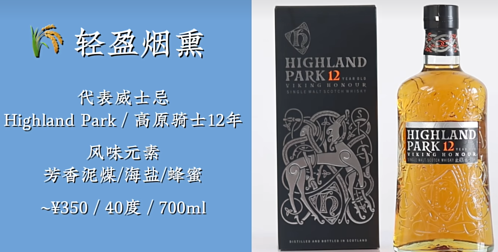

#### 乐加维林Lagavulin

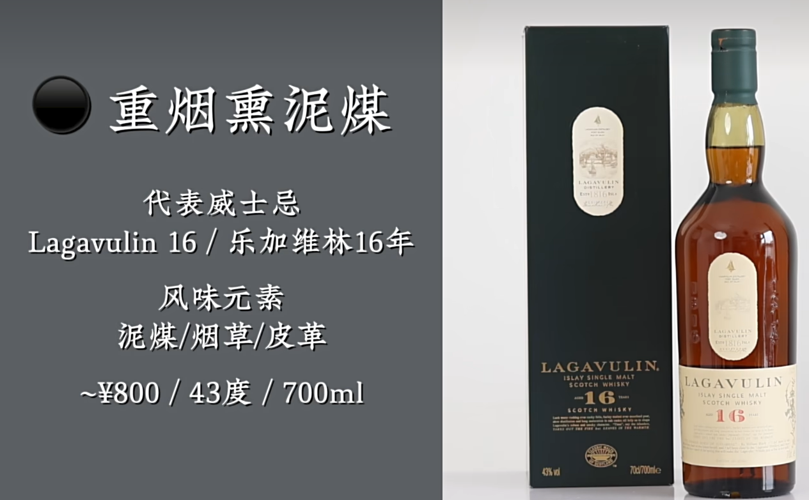

### 伏特加

### 龙舌兰

### 朗姆酒

### 白兰地

### 干邑

### 雪莉酒

### 梅子酒

#### 梅见

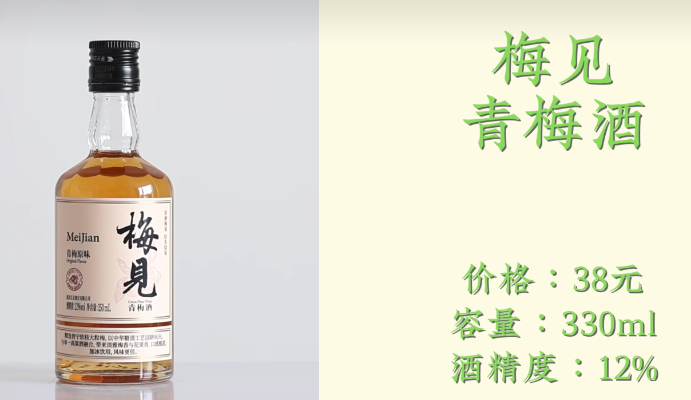

#### 三得利盒装梅酒

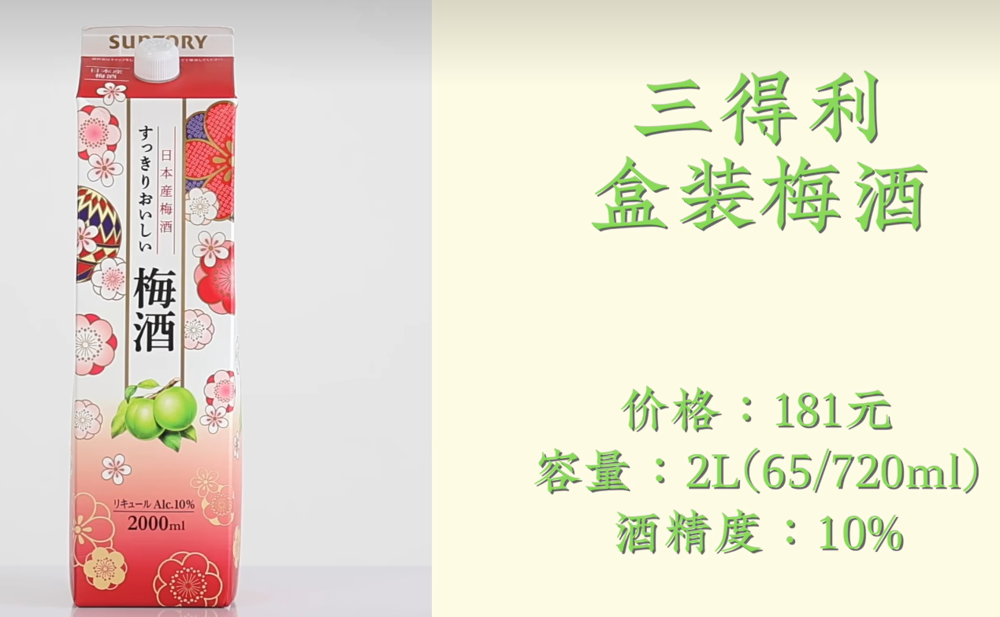

#### 梅乃宿

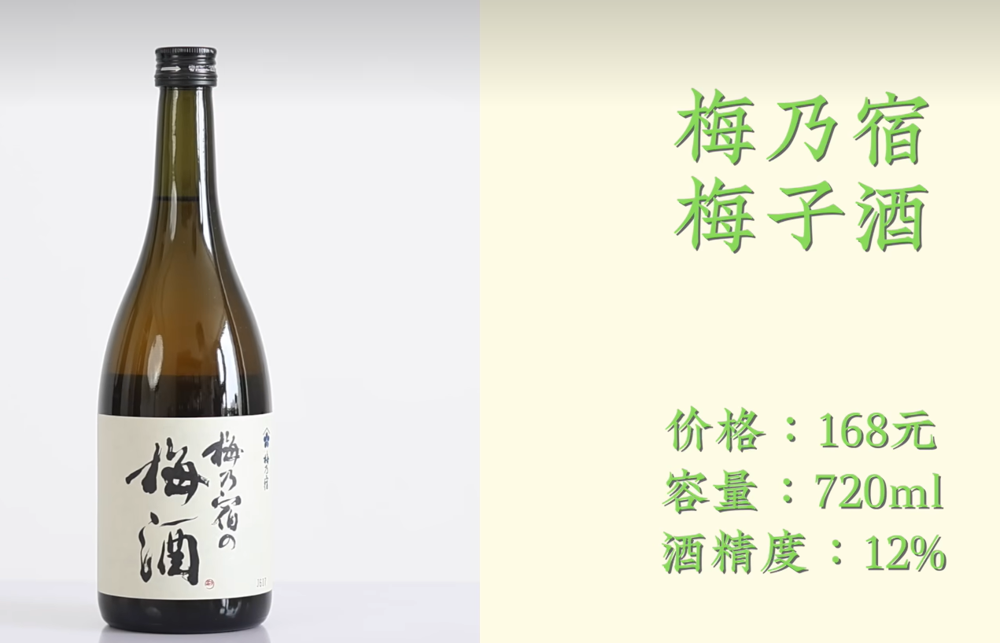

#### 鹤梅完熟果肉梅酒

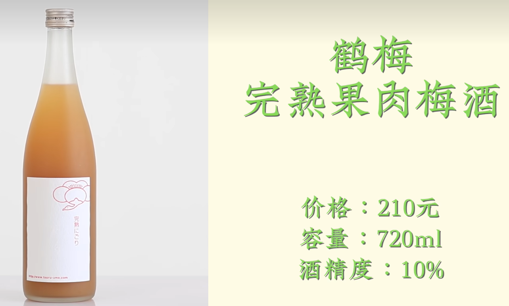

#### CHOYA带梅子本格梅酒

#### CHOYA宇治茶梅酒

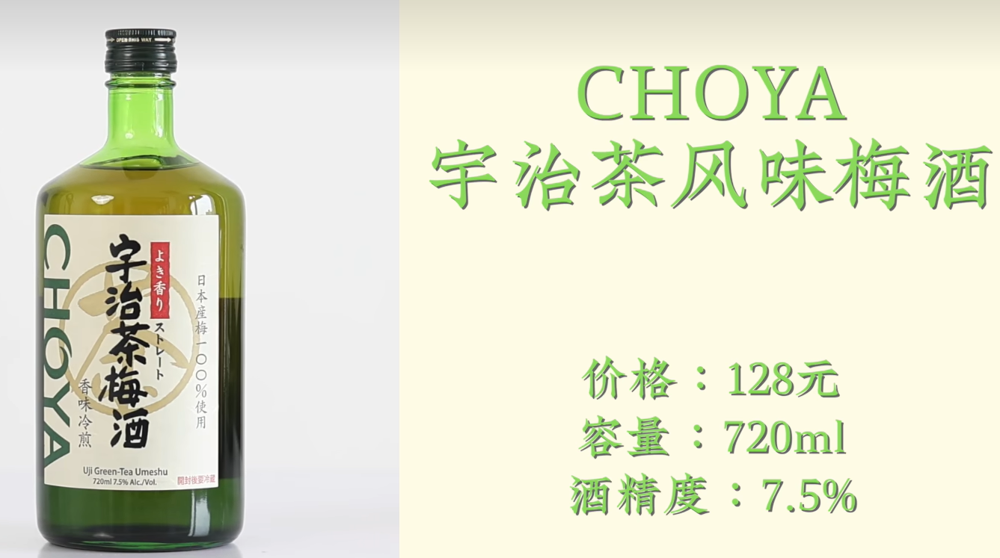

#### 三得利山崎梅酒

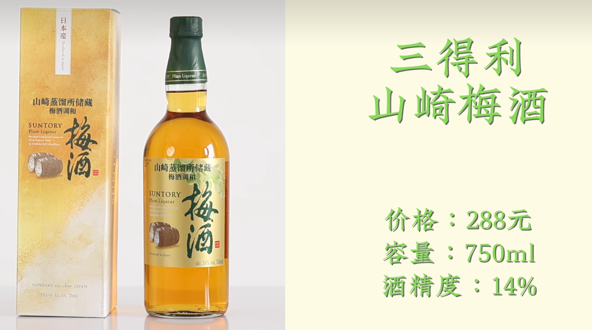

#### 庭之莺欧托罗特选梅子酒

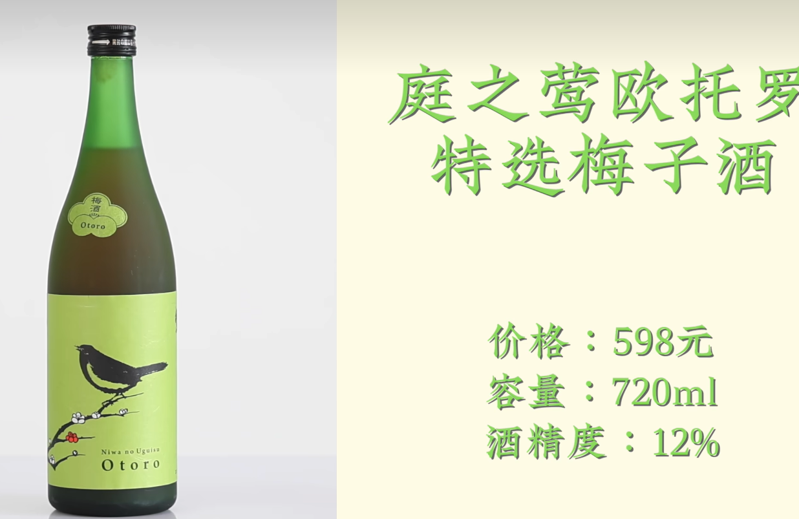

## 调酒菜单

### 金酒基酒

### 威士忌基酒

### 伏特加基酒

### 龙舌兰基酒

### 朗姆酒基酒

### 白兰地基酒

