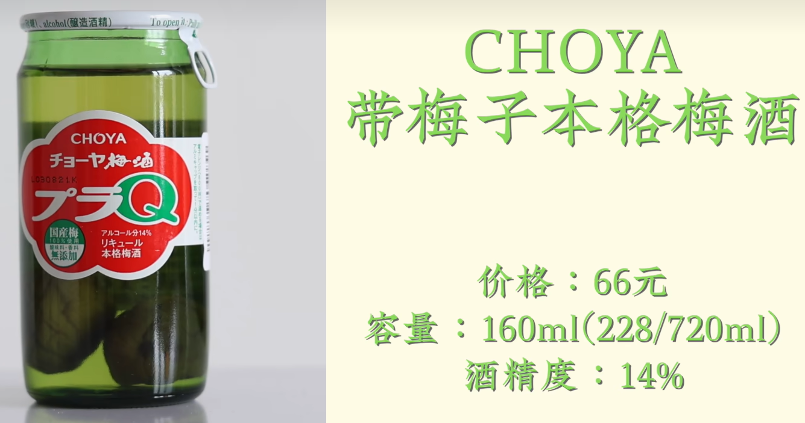

# 	调酒师

> Author: Sylvie233
>
> Date: 23/8/4

[TOC]

## 基础介绍

### 利口酒

### 金酒

### 威士忌

SCOTCH苏格兰威士忌

波本威士忌

#### 芝华士

#### 尊尼获加

#### 白占边Jim Beam

#### 麦卡伦

#### 水牛足迹Buffalo Trace

#### 威凤凰Wild Turkey

#### 美格46Maker's Mark46

#### 巴兹海顿Basil Hayden

#### 酩帝诗Michter's

#### 欧肯特轩AUCHENTOSHAN

#### 格兰威特GLENLIVET

#### 格兰杰GLENMORANGIE

#### 阿贝ARDBEG

#### 欧磨Aultmore

#### 艾伦Arran

#### 亚伯乐阿布纳

#### 高原骑士Highland Park

#### 乐加维林Lagavulin

### 伏特加

### 龙舌兰

### 朗姆酒

### 白兰地

### 干邑

### 雪莉酒

### 梅子酒

#### 梅见

#### 三得利盒装梅酒

#### 梅乃宿

#### 鹤梅完熟果肉梅酒

#### CHOYA带梅子本格梅酒

#### CHOYA宇治茶梅酒

#### 三得利山崎梅酒

#### 庭之莺欧托罗特选梅子酒

## 调酒菜单

### 金酒基酒

### 威士忌基酒

### 伏特加基酒

### 龙舌兰基酒

### 朗姆酒基酒

### 白兰地基酒

